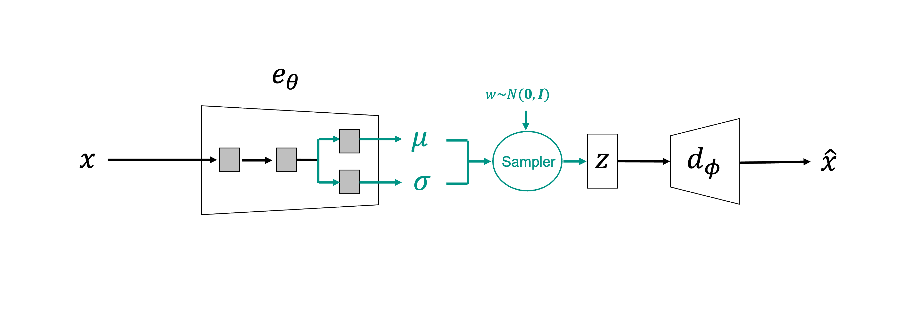

# Generative Modelling and Variational AutoEncoders

Up until now, our attention has been mostly focused on supervised learning tasks where we have access to a certain number
of training samples, in the form of input-target pairs, and we train a model (e.g., a NN) to learn the best possible mapping
between the two. These kind of models are also usually referred to as *discriminative models* as they learn from training samples
their underlying conditional probability distribution $p(\mathbf{y}|\mathbf{x})$.

In the last lecture, we have also seen how the general principles of supervised learning can be adapted to accomplish a
number of different tasks where input-target pairs are not available. Dimensionality reduction is one of such tasks, which are 
usually categorized under the umbrella of unsupervised learning.

Another very exciting area of statistics that has been recently heavily influenced by the deep learning revolution is the
so-called field of *Generative modelling*. Here, instead of having access to input-target pairs, we are able to only gather
a (large) number of samples $\mathbf{X} = \{ \mathbf{x}^{(1)}, \mathbf{x}^{(2)}, ..., \mathbf{x}^{(N_s)} \}$
that we believe come from a given hidden distribution. The task that we wish to accomplished is  therefore:

- Learn the underlying distribution $p(\mathbf{x})$, or 
- Learn to sample from the underlying distribution $\tilde{\mathbf{x}} \sim p(\mathbf{x})$

Obviously, the first task is more general and usually more ambitious. Once you know a distribution, sampling from it is rather an
easy task. In the next two lectures, we will however mostly focused on the second task and discuss two popular algorithms that
have shown impressive capabilities to sample from high-dimensional, complex distributions.

To set the scene, let's take the simplest approach to generative modelling that has nothing to do with neural networks. Let's imagine 
we are provided with $N_s$ multi-dimensional arrays and we are told that they come from a multi-variate gaussian distribution. We can 
set up a generative modelling task as follows:

- Training
     - Compute the sample mean and covariance from the training samples: $\boldsymbol \mu, \boldsymbol \Sigma$
     - Apply the Cholesky decomposition to the covariance matrix: $\boldsymbol \Sigma = \mathbf{L} \mathbf{L}^T$
  
- Inference / Generation
     - Sample a vector from a unitary, zero-mean normal distribution $\mathbf{z} \sim \mathcal{N}(\mathbf{0}, \mathbf{I})$
     - Create a new sample from the true distribution: $\tilde{\mathbf{x}} =  \mathbf{L} \mathbf{z} + \boldsymbol \mu$

Unfortunately, multi-dimensional distributions that we usually find in nature are hardly gaussian and this kind of simple
generative modelling procedure falls short. Nevertheless, the approach that we take with some of the more advanced generative modelling
methods that we are going to discuss later on in this lecture does not differ from what we have done so far. A training phase, where the 
free-parameters of the chosen parametric model (e.g., a NN) are learned from the available data, followed by a generation phase that uses
the trained model and some stochastic input (like the $\mathbf{z}$ vector in the example above).

## Variational AutoEncoders (VAEs)

As the name implies, these networks take inspiration from the AutoEncoder networks that we have presented in the previous lecture. However, some 
small, yet fundamental changes are implemented to the network architecture as well as the learning process (i.e., loss function) to turn such family
of networks from being able to perform dimensionality reduction to being generative models. 

Let's start by looking at a schematic representation of a VAEs:

Even before we delve into the mathematical details, we can clearly see that one main change has been implemented to the network architecture:

## Additional readings

- A Python library that can help you step up your game with Variational Inference is [Pyro](https://pyro.ai) from Uber.